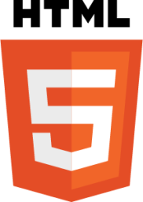
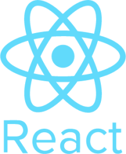
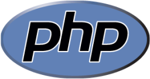
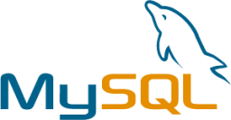

# Hi everyone! 👋
Mi name is Diego, and I have just started a new path in my life.
in 14th july 2022 I finished a Full Stack Web Developer bootcamp and I'm now ready to face new challenges.\

\

# What have I seen?
        

<!-- - 🔭 I’m currently working on ...
- 🌱 I’m currently learning ...
- 👯 I’m looking to collaborate on ...
- 🤔 I’m looking for help with ...
- 💬 Ask me about ...
- 📫 How to reach me: ...
- 😄 Pronouns: ...
- ⚡ Fun fact: ...
--> -->
